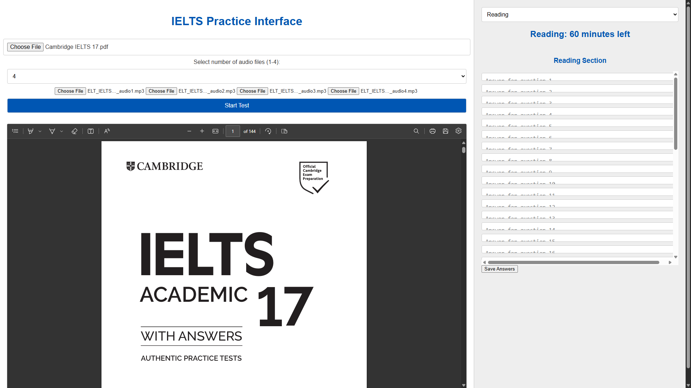
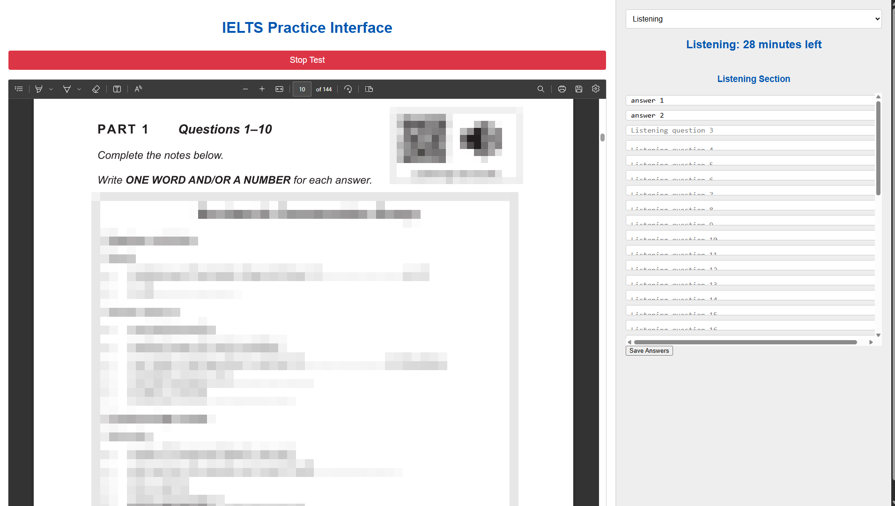

# IELTS Practice

Welcome to the IELTS Practice repository! This project provides a Basic interface for practicing the IELTS Computer-Based Test. The repository includes two HTML files:
- **IELTS_Basic.html**: A bare-bones version of the website without any additional CSS, focused on the main content.
- **IELTS_Main.html**: A visually appealing version of the website with an enhanced design.

## Important Notes
- Please save your answers before moving to the new section. 
- You will be able to download all files from the writing section to check your answers.

### Requirements for the Test
To effectively use this interface, you will need:
- Your official IELTS papers.
- Audio files for the listening section (up to 4 audio files must be uploaded).
- Access to the PDF book to complete the test.

## Usage
To use the files:
1. Download the HTML files to your local machine.
2. Open the `IELTS_Main.html` file in a web browser for the best experience.
3. Make sure to listen to the provided audio files while practicing.

## Image
  
  
## Disclaimer
This repository does not contain any sample papers due to copyright reasons. It is intended solely as an interface for home practice.

Happy practicing!
